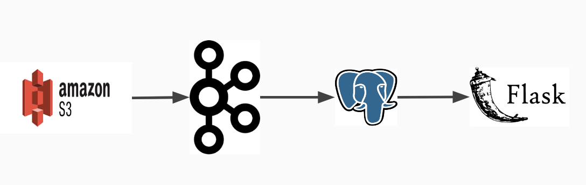

# UShare

* [slides]

## Project Idea

Provide solution for Ride sharing problem using Graph Algorithm.
Building the simplified Data pipeline using Kafka Streams
Kafka does not have default graph processing APIs unlike Spark GraphX and Flink Gelly.
Came across GitHub repo, [Kafka-Graphs] which has pre built version of graph algorithms based on Google pregel computation model.
I would like to contribute randomized maximum bipartite matching algorithm to the open source repo as part of the project

## Business Use case

Driver Rider matching in Ride sharing is one of the complex problems which qualifies as NP-Hard problem.
Minimizing the cost of computation & travel distance (driver) can benefit the organization.
Customizing open source frameworks is a legitimate use case for number of organizations.

## Engineering Challange

Kafka doesn't have built in Library for Streaming Graph processing. 
Using and customizing the open source library (not in incubation yet) 
There are blind spots in gathering the perect data. e.g. dirver's current location is not present in NYC Texi dataset

## Dataset

[NYC-Texi-Rides]
The yellow and green taxi trip records include fields capturing pick-up and drop-off dates/times, pick-up and drop-off locations, trip distances, itemized fares, rate types, payment types, and driver-reported passenger counts. The data used in the attached datasets were collected and provided to the NYC Taxi and Limousine Commission (TLC) by technology providers authorized under the Taxicab & Livery Passenger Enhancement Programs (TPEP/LPEP). The trip data was not created by the TLC, and TLC makes no representations as to the accuracy of these data.

## Tech Stack

[slides]: https://docs.google.com/presentation/d/1nU3rWpFfQganNrtOrHuxNptB9rt6fwZElzJAdsZ7r_4/edit?usp=sharing
[Kafka-Graphs]: https://github.com/rayokota/kafka-graphs.git
[NYC-Texi-Rides]: https://www1.nyc.gov/assets/tlc/downloads/pdf/data_dictionary_trip_records_green.pdf
