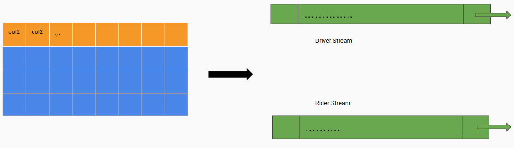
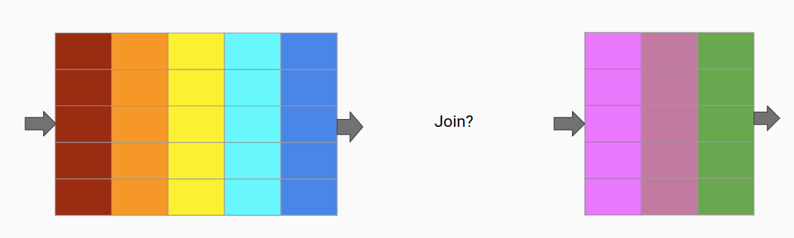
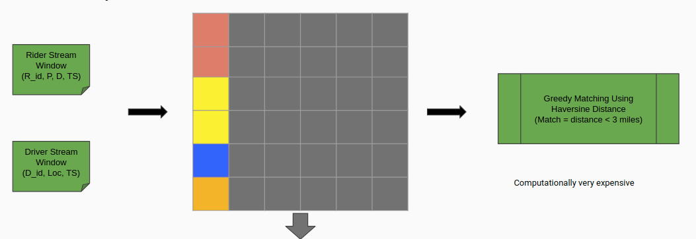
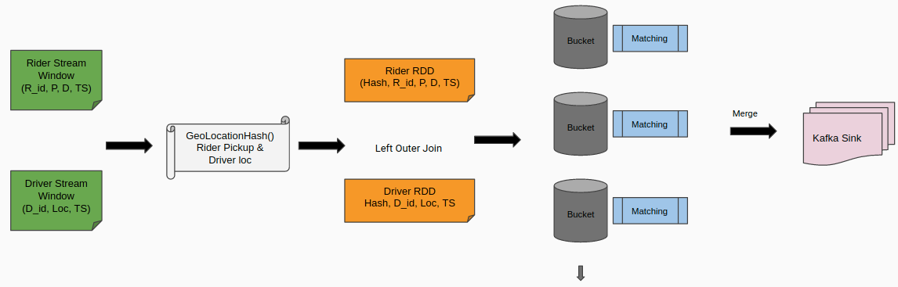
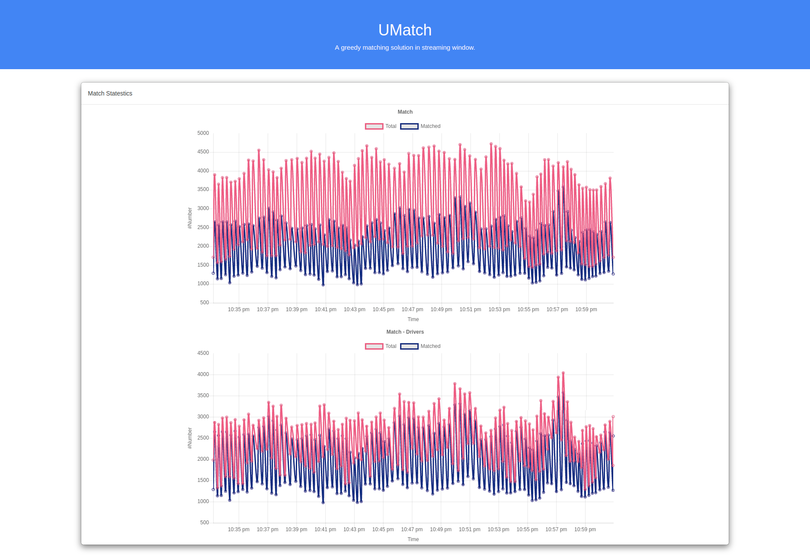
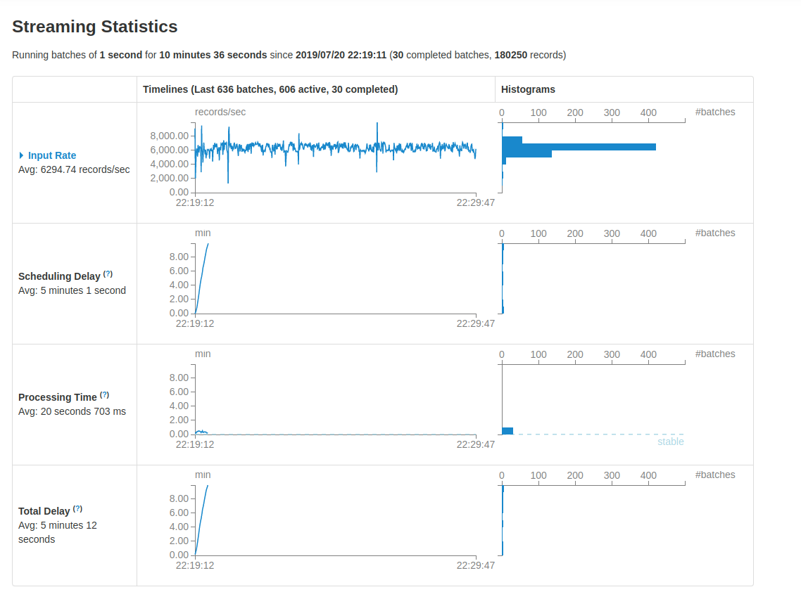

# UMatch

* [slides]

## Project Idea

Building the Greedy Bipartite Matching in real time. 
The use case here is to match the ride requests to the drivers in a streaming window.

## Business Use case

* Developing a algorithmic real time data piple on unbounded stream of data.
* Decent usability for matching usecases like, Rider matching, Food delivery, Transportation networks, Network Traffic etc.

## Tech Stack

## Dataset

[NYC-Texi-Rides]
The yellow and green taxi trip records include fields capturing pick-up and drop-off dates/times, pick-up and drop-off locations, trip distances, itemized fares, rate types, payment types, and driver-reported passenger counts.

## Engineering Challange

#### 1. Simulate Live stream of drivers and Riders
* NYC taxi data contains information of finished taxi trips. 
* Moreover, NYC taxi trips doesn't contain the Driver's location information.
* For my usecase I needed to simmulate two unbounded live data streams for Drivers Live locations and Rider's live Location.

#### 2. Joining two data streams without common key
* I simmulated the two unbounded data streams with the some synthetic data and appended a timestamp at the end of each stream record.
* But then the challenge was in joining the two streams. Because none of them contain any common key.
* Moreover, if I join the stream using timestamp as a key, then I will be only able to find match between Drivers and Riders who were in the streaming window at time 'T'.

#### 3. if do cartesian join between two window (RDD)?
* The eaiest way to join the stream in these conditions is to do <b>cartasian join.</b>
* But it is computationally costly. 
* After I collect the join result and run my Greedy matching algorithm, it was taking a quite a good amount of time to compute one window's matching statestics.

## The Algorithm
* Below is the visual representation of my algorithm.
* I created location has using python-Geohash and append it as a key in RDD.
* The [precision] of hash is 5 decimal point.
* Join results will create small buckets of Riders and Drivers.
* In each bucket I am assigning Driver to Rider based on greedy herversine distance condition.

## The Snapshot
* Here is a snapshot of my front end UI.

## Tech Stack Selection Journey

 * Bipartite Matching is a graph problem. I tried to look for the libraries which does graph computation in distributed environment.
 * The graph computation in distributed environemtn follows google pregel model and it is best suited for batch process only. 
* Spark GraphX and Flink Gelly also use the same computation model.
* Came across GitHub repo, [Kafka-Graphs] which has pre built version of graph algorithms based on Google pregel computation model. I first though of using it in a streaming window, but then I spoke with the repo owner and discussed if it is suited for my usecase and turns out it is not. P.S. working on contributing randomized bipartite matching in the repo.
* Then I came across an [article], which described how to build the greedy bipartite matching using left outer join.

## Performance

[slides]: https://docs.google.com/presentation/d/1nU3rWpFfQganNrtOrHuxNptB9rt6fwZElzJAdsZ7r_4/edit?usp=sharing
[Kafka-Graphs]: https://github.com/rayokota/kafka-graphs.git
[NYC-Texi-Rides]: https://www1.nyc.gov/assets/tlc/downloads/pdf/data_dictionary_trip_records_green.pdf
[article]: https://medium.com/@patrick.cording/the-use-once-join-or-matching-in-bipartite-graphs-with-spark-6070041cb555
[precision]: https://en.wikipedia.org/wiki/Geohash
